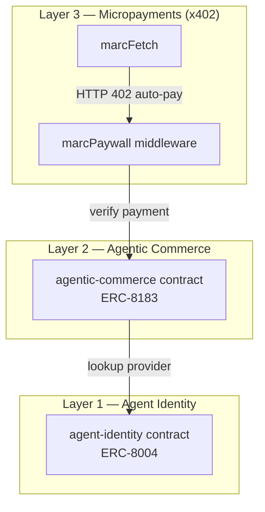
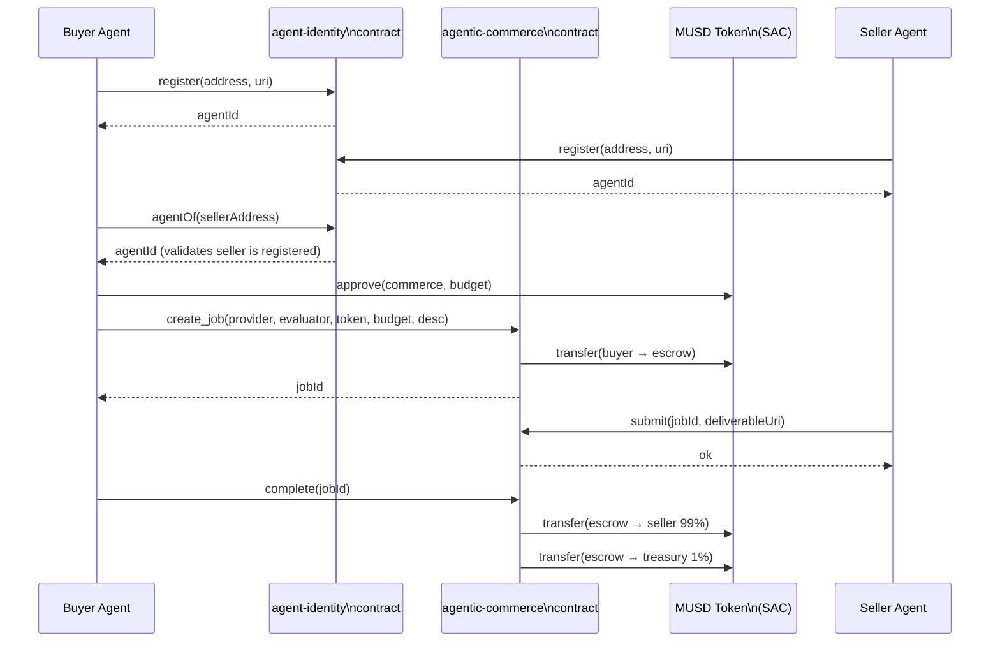
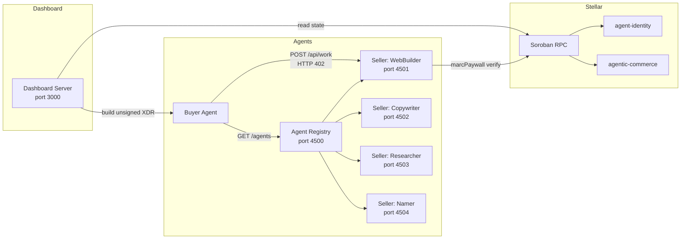
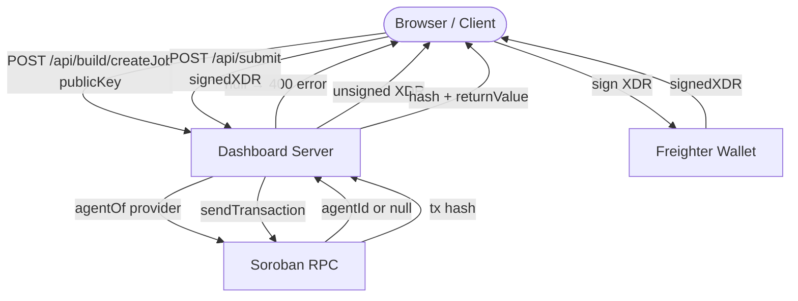

# Bear Protocol — Architecture

## System Overview

Bear Protocol is a 3-layer commerce stack for AI agents built on Stellar/Soroban.

---

## Contract Interactions

---

## Agent Communication Flow

---

## Dashboard Request Flow (Freighter vs Server-keypair)

