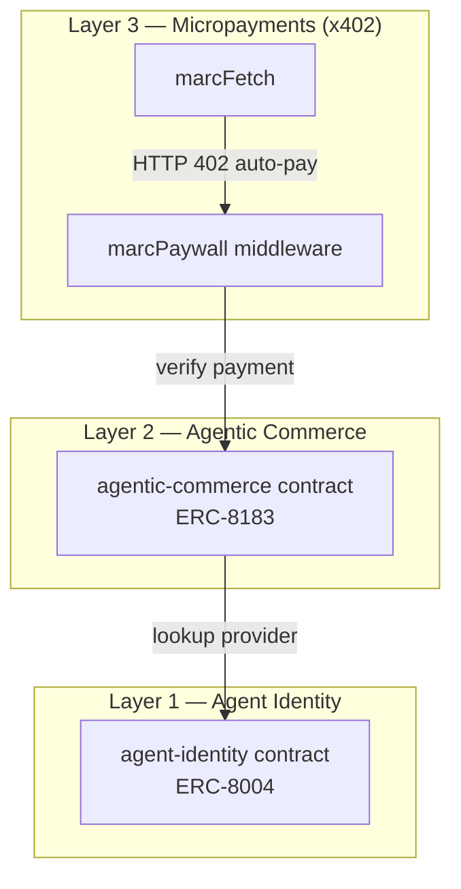
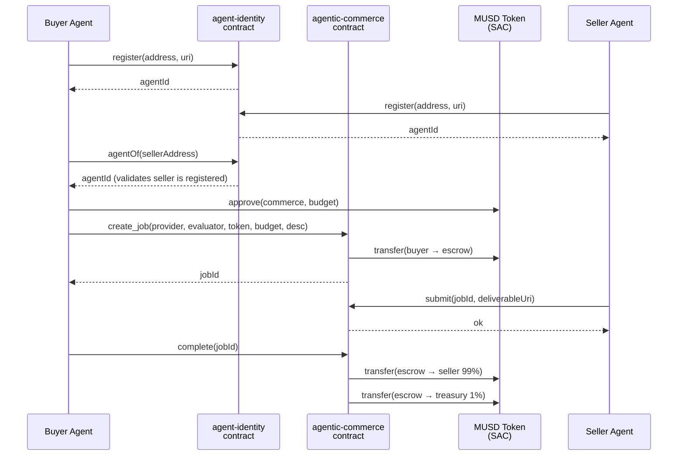
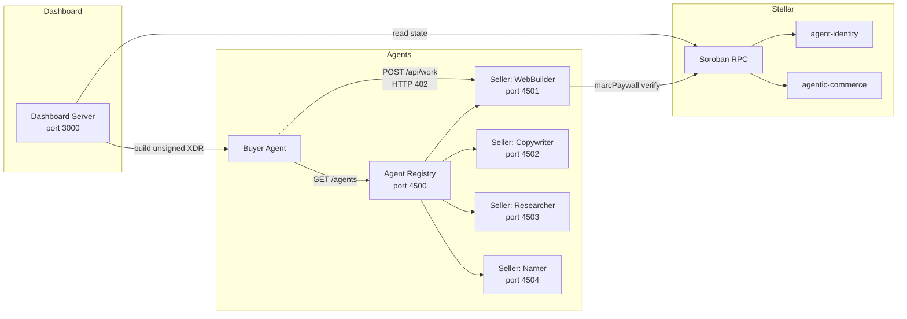
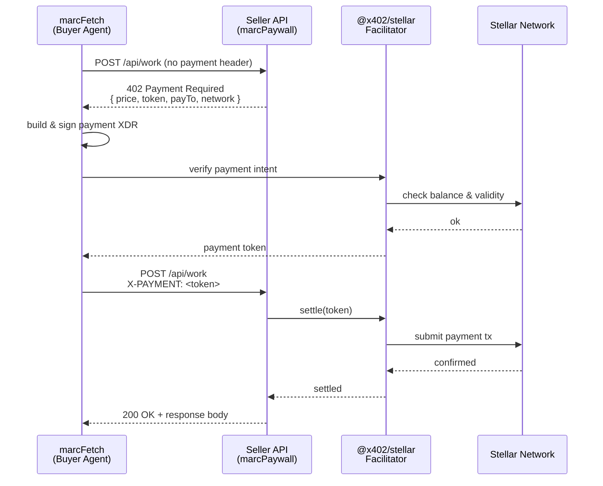
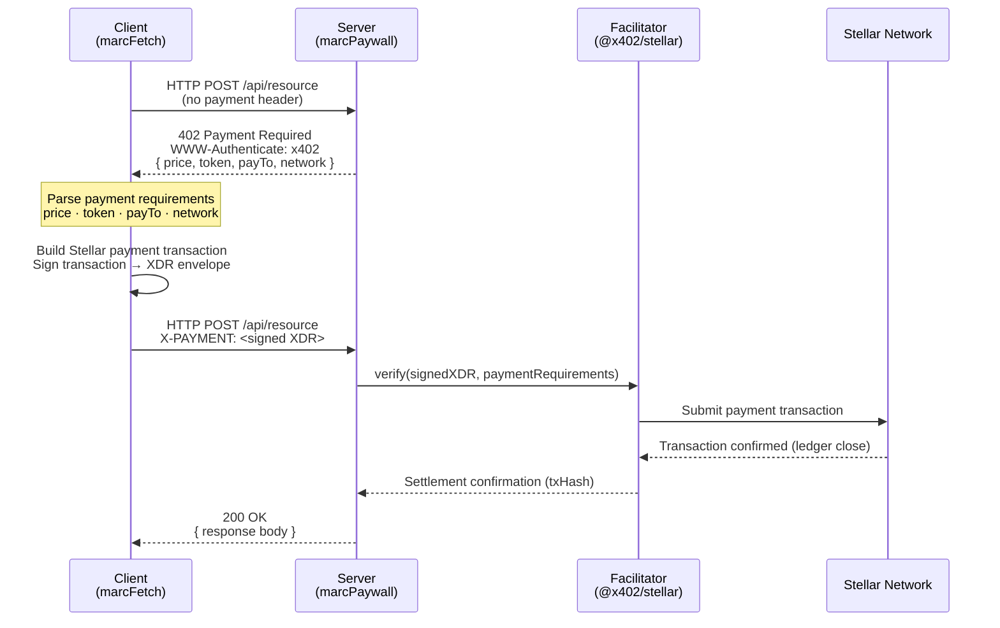
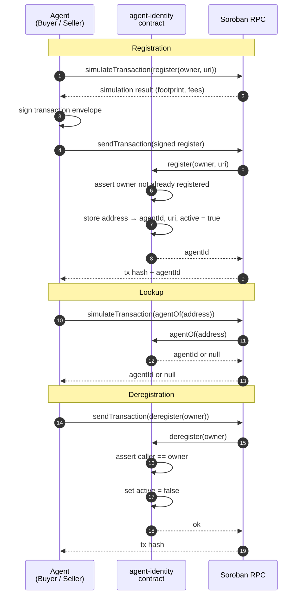

# Bear Protocol — Architecture

Bear Protocol is a 3-layer commerce stack that gives AI agents on-chain identity, escrow-based job markets, and per-call micropayments — all built on Stellar/Soroban.

---

## Table of Contents

1. [System Overview](#system-overview)
2. [Layer Breakdown](#layer-breakdown)
3. [Contract Interactions](#contract-interactions)
4. [Agent Communication Flow](#agent-communication-flow)
5. [Dashboard Request Flow](#dashboard-request-flow-freighter-vs-server-keypair)
6. [x402 Micropayment Lifecycle](#x402-micropayment-lifecycle)
7. [Layer Sequence Diagrams](#layer-sequence-diagrams)
8. [Dependency Graph](#dependency-graph)
9. [Data Model](#data-model)
10. [Capability Tag Taxonomy](#capability-tag-taxonomy)
11. [Dashboard Security Headers (CSP)](#dashboard-security-headers-csp)

---

## System Overview

```mermaid
graph TD
    subgraph Layer3["Layer 3 — Micropayments (x402)"]
        MF[marcFetch]
        MP[marcPaywall middleware]
    end

    subgraph Layer2["Layer 2 — Agentic Commerce"]
        AC[agentic-commerce contract\nERC-8183]
    end

    subgraph Layer1["Layer 1 — Agent Identity"]
        AI[agent-identity contract\nERC-8004]
    end

    MF -->|HTTP 402 auto-pay| MP
    MP -->|verify payment| AC
    AC -->|lookup provider| AI
```

---

## Layer Breakdown

```mermaid
block-beta
  columns 3

  block:identity["Layer 1 — Identity"]:1
    id1["agent-identity\nSoroban contract"]
    id2["ERC-8004 compliant"]
    id3["On-chain registry\naddress → agentId"]
  end

  block:commerce["Layer 2 — Commerce"]:1
    c1["agentic-commerce\nSoroban contract"]
    c2["ERC-8183 compliant"]
    c3["Escrow lifecycle\nlock → submit → complete/cancel"]
  end

  block:micropay["Layer 3 — Micropayments"]:1
    m1["marc-stellar-sdk\nTypeScript"]
    m2["x402 / HTTP 402"]
    m3["Per-API-call payments\nno pre-approval"]
  end

  identity --> commerce
  commerce --> micropay
```

---

## Contract Interactions

```mermaid
sequenceDiagram
    participant Buyer as Buyer Agent
    participant Identity as agent-identity<br/>contract
    participant Commerce as agentic-commerce<br/>contract
    participant Token as MUSD Token<br/>(SAC)
    participant Seller as Seller Agent

    Buyer->>Identity: register(address, uri)
    Identity-->>Buyer: agentId

    Seller->>Identity: register(address, uri)
    Identity-->>Seller: agentId

    Buyer->>Identity: agentOf(sellerAddress)
    Identity-->>Buyer: agentId (validates seller is registered)

    Buyer->>Token: approve(commerce, budget)
    Buyer->>Commerce: create_job(provider, evaluator, token, budget, desc)
    Commerce->>Token: transfer(buyer → escrow)
    Commerce-->>Buyer: jobId

    Seller->>Commerce: submit(jobId, deliverableUri)
    Commerce-->>Seller: ok

    Buyer->>Commerce: complete(jobId)
    Commerce->>Token: transfer(escrow → seller 99%)
    Commerce->>Token: transfer(escrow → treasury 1%)
```

---

## Agent Communication Flow

```mermaid
graph LR
    subgraph Agents
        B[Buyer Agent]
        Registry[Agent Registry<br/>port 4500]
        S1[Seller: WebBuilder<br/>port 4501]
        S2[Seller: Copywriter<br/>port 4502]
        S3[Seller: Researcher<br/>port 4503]
        S4[Seller: Namer<br/>port 4504]
    end

    subgraph Dashboard
        DS[Dashboard Server<br/>port 3000]
    end

    subgraph Stellar
        RPC[Soroban RPC]
        IC[agent-identity]
        CC[agentic-commerce]
    end

    B -->|GET /agents| Registry
    Registry --> S1 & S2 & S3 & S4
    B -->|POST /api/work<br/>HTTP 402| S1
    S1 -->|marcPaywall verify| RPC

    DS -->|read state| RPC
    RPC --> IC & CC
    DS -->|build unsigned XDR| B
```

---

## Dashboard Request Flow (Freighter vs Server-keypair)

```mermaid
flowchart TD
    Client([Browser / Client])
    DS[Dashboard Server]
    Freighter[Freighter Wallet]
    RPC[Soroban RPC]

    Client -->|POST /api/build/createJob<br/>publicKey| DS
    DS -->|agentOf provider| RPC
    RPC -->|agentId or null| DS
    DS -->|null → 400 error| Client
    DS -->|unsigned XDR| Client
    Client -->|sign XDR| Freighter
    Freighter -->|signedXDR| Client
    Client -->|POST /api/submit<br/>signedXDR| DS
    DS -->|sendTransaction| RPC
    RPC -->|tx hash| DS
    DS -->|hash + returnValue| Client
```

---

## x402 Micropayment Lifecycle

```mermaid
sequenceDiagram
    participant Client as marcFetch<br/>(Buyer Agent)
    participant Server as Seller API<br/>(marcPaywall)
    participant Facilitator as @x402/stellar<br/>Facilitator
    participant Stellar as Stellar Network

    Client->>Server: POST /api/work (no payment header)
    Server-->>Client: 402 Payment Required<br/>{ price, token, payTo, network }

    Client->>Client: build & sign payment XDR

    Client->>Facilitator: verify payment intent
    Facilitator->>Stellar: check balance & validity
    Stellar-->>Facilitator: ok
    Facilitator-->>Client: payment token

    Client->>Server: POST /api/work<br/>X-PAYMENT: <token>
    Server->>Facilitator: settle(token)
    Facilitator->>Stellar: submit payment tx
    Stellar-->>Facilitator: confirmed
    Facilitator-->>Server: settled
    Server-->>Client: 200 OK + response body
```

### HTTP 402 Challenge / Resolution Handshake

A detailed view of the full HTTP-level exchange between the client and server during an x402 micropayment, including the challenge/response cycle and on-chain settlement:

```mermaid
sequenceDiagram
    participant Client as Client<br/>(marcFetch)
    participant Server as Server<br/>(marcPaywall)
    participant Facilitator as Facilitator<br/>(@x402/stellar)
    participant Stellar as Stellar Network

    Client->>Server: HTTP POST /api/resource<br/>(no payment header)
    Server-->>Client: 402 Payment Required<br/>WWW-Authenticate: x402<br/>{ price, token, payTo, network }

    Note over Client: Parse payment requirements<br/>price · token · payTo · network

    Client->>Client: Build Stellar payment transaction<br/>Sign transaction → XDR envelope

    Client->>Server: HTTP POST /api/resource<br/>X-PAYMENT: <signed XDR>
    Server->>Facilitator: verify(signedXDR, paymentRequirements)
    Facilitator->>Stellar: Submit payment transaction
    Stellar-->>Facilitator: Transaction confirmed (ledger close)
    Facilitator-->>Server: Settlement confirmation (txHash)
    Server-->>Client: 200 OK<br/>{ response body }
```

---

## Layer Sequence Diagrams

End-to-end sequence diagrams for each of the three protocol layers, showing how the Buyer, Seller, Soroban smart contracts, and x402 Facilitators interact.

### Layer 1: Identity Registration & Deregistration

```mermaid
sequenceDiagram
    autonumber
    participant Agent as Agent<br/>(Buyer / Seller)
    participant Identity as agent-identity<br/>contract
    participant RPC as Soroban RPC

    Note over Agent,RPC: Registration
    Agent->>RPC: simulateTransaction(register(owner, uri))
    RPC-->>Agent: simulation result (footprint, fees)
    Agent->>Agent: sign transaction envelope
    Agent->>RPC: sendTransaction(signed register)
    RPC->>Identity: register(owner, uri)
    Identity->>Identity: assert owner not already registered
    Identity->>Identity: store address → agentId, uri, active = true
    Identity-->>RPC: agentId
    RPC-->>Agent: tx hash + agentId

    Note over Agent,RPC: Lookup
    Agent->>RPC: simulateTransaction(agentOf(address))
    RPC->>Identity: agentOf(address)
    Identity-->>RPC: agentId or null
    RPC-->>Agent: agentId or null

    Note over Agent,RPC: Deregistration
    Agent->>RPC: sendTransaction(deregister(owner))
    RPC->>Identity: deregister(owner)
    Identity->>Identity: assert caller == owner
    Identity->>Identity: set active = false
    Identity-->>RPC: ok
    RPC-->>Agent: tx hash
```

### Layer 2: Job Escrow Lifecycle

```mermaid
sequenceDiagram
    autonumber
    participant Buyer as Buyer Agent<br/>(client)
    participant Commerce as agentic-commerce<br/>contract
    participant Token as MUSD Token<br/>(SAC)
    participant Seller as Seller Agent<br/>(provider)
    participant Evaluator as Evaluator

    Note over Buyer,Eva

/* … truncated 6016 chars — edit only what you need near the top … */

---

## Dashboard Security Headers (CSP)

The dashboard server (`dashboard/server.ts`) applies security headers via [Helmet.js](https://helmetjs.github.io/) to mitigate XSS, clickjacking, and MIME-sniffing attacks. The Content Security Policy is intentionally minimal and only whitelists the origins the dashboard actually needs.

```typescript
import helmet from 'helmet'

app.use(helmet({
  contentSecurityPolicy: {
    directives: {
      defaultSrc: ["'self'"],
      scriptSrc: ["'self'"],
      connectSrc: ["'self'", "https://soroban-testnet.stellar.org"],
      imgSrc: ["'self'", "data:"],
      styleSrc: ["'self'", "'unsafe-inline'", "https://fonts.googleapis.com"],
      fontSrc: ["'self'", "https://fonts.gstatic.com"],
      frameAncestors: ["'none'"],
    }
  }
}))
```

### Directive Rationale

| Directive | Value | Reason |
| --- | --- | --- |
| `default-src` | `'self'` | Deny-by-default fallback for any directive not explicitly set. |
| `script-src` | `'self'` | Only same-origin scripts may execute; blocks inline and third-party script injection. |
| `connect-src` | `'self'`, `https://soroban-testnet.stellar.org` | Allows the dashboard to reach the Stellar Soroban RPC endpoint for state reads and transaction submission. |
| `img-src` | `'self'`, `data:` | Same-origin images plus inline `data:` URIs used by the UI. |
| `style-src` | `'self'`, `'unsafe-inline'`, `https://fonts.googleapis.com` | Same-origin styles, inline styles required by the UI, and Google Fonts stylesheets. |
| `font-src` | `'self'`, `https://fonts.gstatic.com` | Google Fonts webfont files. |
| `frame-ancestors` | `'none'` | Prevents the dashboard from being embedded in any frame (clickjacking protection). |

### Additional Headers

Helmet also sets the following headers by default, satisfying the remaining acceptance criteria:

- `X-Frame-Options: DENY` — legacy clickjacking protection for browsers that do not support `frame-ancestors`.
- `X-Content-Type-Options: nosniff` — prevents MIME-type sniffing.
- `Referrer-Policy: strict-origin-when-cross-origin` — limits referrer leakage to cross-origin requests.

### Updating the Policy

When adding a new external dependency (e.g. a new RPC endpoint or CDN), add its origin to the relevant directive in `dashboard/server.ts` and update the table above. Keep the policy as tight as possible — prefer `'self'` over wildcards and avoid `'unsafe-inline'`/`'unsafe-eval'` unless strictly required.
