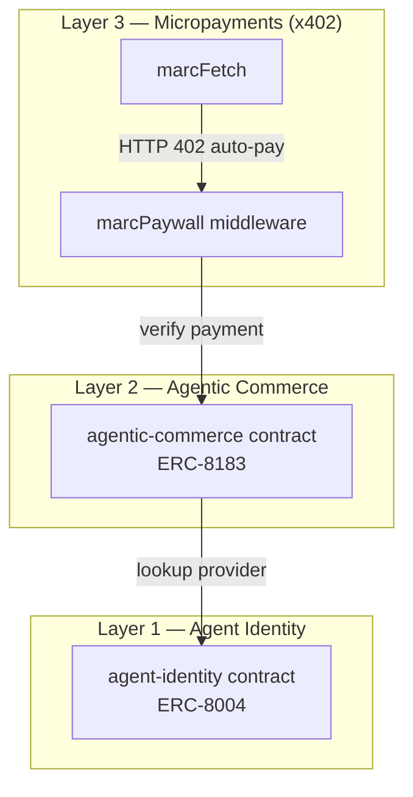
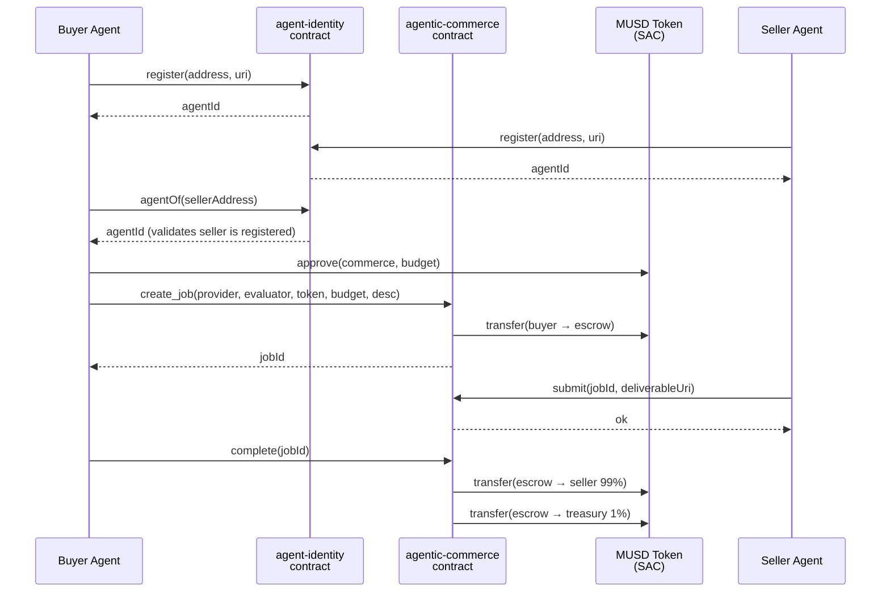
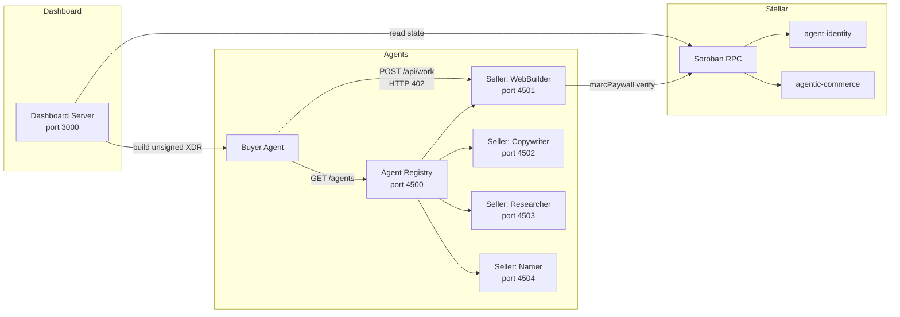
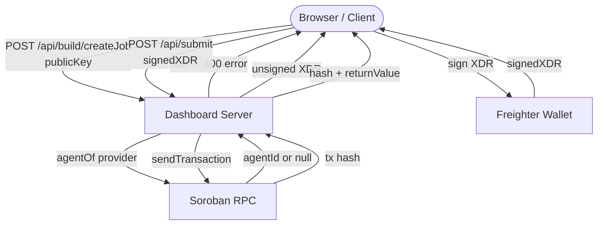
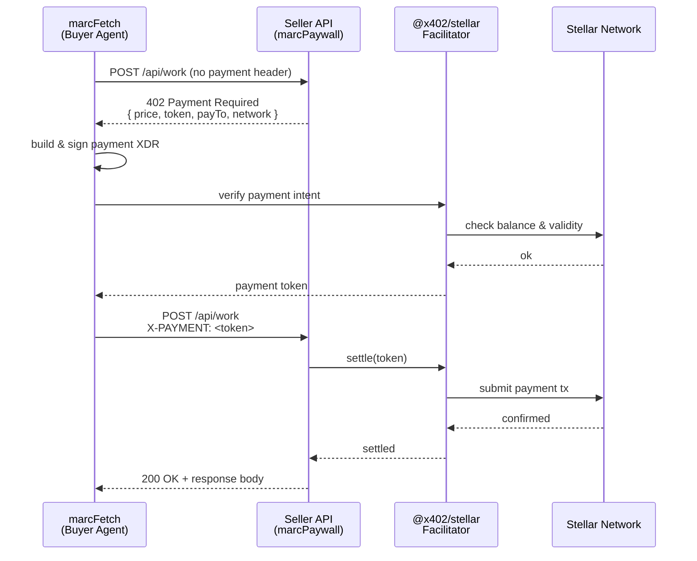
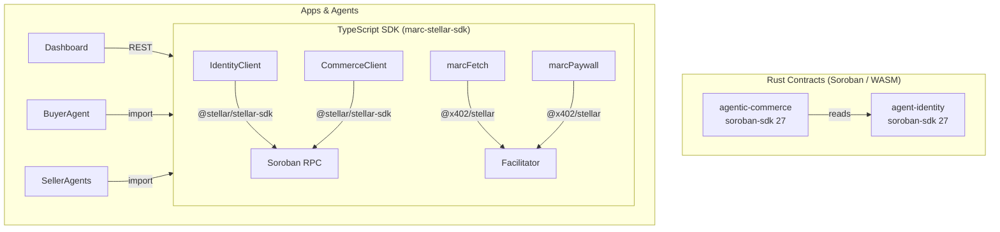
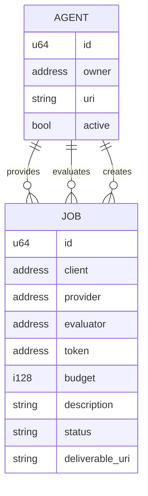

# Bear Protocol — Architecture

Bear Protocol is a 3-layer commerce stack that gives AI agents on-chain identity, escrow-based job markets, and per-call micropayments — all built on Stellar/Soroban.

---

## Table of Contents

1. [System Overview](#system-overview)
2. [Layer Breakdown](#layer-breakdown)
3. [Contract Interactions](#contract-interactions)
4. [Agent Communication Flow](#agent-communication-flow)
5. [Dashboard Request Flow](#dashboard-request-flow-freighter-vs-server-keypair)
6. [x402 Micropayment Lifecycle](#x402-micropayment-lifecycle)
7. [Dependency Graph](#dependency-graph)
8. [Data Model](#data-model)

---

## System Overview

```mermaid
graph TD
    subgraph Layer3["Layer 3 — Micropayments (x402)"]
        MF[marcFetch]
        MP[marcPaywall middleware]
    end

    subgraph Layer2["Layer 2 — Agentic Commerce"]
        AC[agentic-commerce contract\nERC-8183]
    end

    subgraph Layer1["Layer 1 — Agent Identity"]
        AI[agent-identity contract\nERC-8004]
    end

    MF -->|HTTP 402 auto-pay| MP
    MP -->|verify payment| AC
    AC -->|lookup provider| AI
```

---

## Layer Breakdown

```mermaid
block-beta
  columns 3

  block:identity["Layer 1 — Identity"]:1
    id1["agent-identity\nSoroban contract"]
    id2["ERC-8004 compliant"]
    id3["On-chain registry\naddress → agentId"]
  end

  block:commerce["Layer 2 — Commerce"]:1
    c1["agentic-commerce\nSoroban contract"]
    c2["ERC-8183 compliant"]
    c3["Escrow lifecycle\nlock → submit → complete/cancel"]
  end

  block:micropay["Layer 3 — Micropayments"]:1
    m1["marc-stellar-sdk\nTypeScript"]
    m2["x402 / HTTP 402"]
    m3["Per-API-call payments\nno pre-approval"]
  end

  identity --> commerce
  commerce --> micropay
```

---

## Contract Interactions

```mermaid
sequenceDiagram
    participant Buyer as Buyer Agent
    participant Identity as agent-identity<br/>contract
    participant Commerce as agentic-commerce<br/>contract
    participant Token as MUSD Token<br/>(SAC)
    participant Seller as Seller Agent

    Buyer->>Identity: register(address, uri)
    Identity-->>Buyer: agentId

    Seller->>Identity: register(address, uri)
    Identity-->>Seller: agentId

    Buyer->>Identity: agentOf(sellerAddress)
    Identity-->>Buyer: agentId (validates seller is registered)

    Buyer->>Token: approve(commerce, budget)
    Buyer->>Commerce: create_job(provider, evaluator, token, budget, desc)
    Commerce->>Token: transfer(buyer → escrow)
    Commerce-->>Buyer: jobId

    Seller->>Commerce: submit(jobId, deliverableUri)
    Commerce-->>Seller: ok

    Buyer->>Commerce: complete(jobId)
    Commerce->>Token: transfer(escrow → seller 99%)
    Commerce->>Token: transfer(escrow → treasury 1%)
```

---

## Agent Communication Flow

```mermaid
graph LR
    subgraph Agents
        B[Buyer Agent]
        Registry[Agent Registry<br/>port 4500]
        S1[Seller: WebBuilder<br/>port 4501]
        S2[Seller: Copywriter<br/>port 4502]
        S3[Seller: Researcher<br/>port 4503]
        S4[Seller: Namer<br/>port 4504]
    end

    subgraph Dashboard
        DS[Dashboard Server<br/>port 3000]
    end

    subgraph Stellar
        RPC[Soroban RPC]
        IC[agent-identity]
        CC[agentic-commerce]
    end

    B -->|GET /agents| Registry
    Registry --> S1 & S2 & S3 & S4
    B -->|POST /api/work<br/>HTTP 402| S1
    S1 -->|marcPaywall verify| RPC

    DS -->|read state| RPC
    RPC --> IC & CC
    DS -->|build unsigned XDR| B
```

---

## Dashboard Request Flow (Freighter vs Server-keypair)

```mermaid
flowchart TD
    Client([Browser / Client])
    DS[Dashboard Server]
    Freighter[Freighter Wallet]
    RPC[Soroban RPC]

    Client -->|POST /api/build/createJob<br/>publicKey| DS
    DS -->|agentOf provider| RPC
    RPC -->|agentId or null| DS
    DS -->|null → 400 error| Client
    DS -->|unsigned XDR| Client
    Client -->|sign XDR| Freighter
    Freighter -->|signedXDR| Client
    Client -->|POST /api/submit<br/>signedXDR| DS
    DS -->|sendTransaction| RPC
    RPC -->|tx hash| DS
    DS -->|hash + returnValue| Client
```

---

## x402 Micropayment Lifecycle

```mermaid
sequenceDiagram
    participant Client as marcFetch<br/>(Buyer Agent)
    participant Server as Seller API<br/>(marcPaywall)
    participant Facilitator as @x402/stellar<br/>Facilitator
    participant Stellar as Stellar Network

    Client->>Server: POST /api/work (no payment header)
    Server-->>Client: 402 Payment Required<br/>{ price, token, payTo, network }

    Client->>Client: build & sign payment XDR

    Client->>Facilitator: verify payment intent
    Facilitator->>Stellar: check balance & validity
    Stellar-->>Facilitator: ok
    Facilitator-->>Client: payment token

    Client->>Server: POST /api/work<br/>X-PAYMENT: <token>
    Server->>Facilitator: settle(token)
    Facilitator->>Stellar: submit payment tx
    Stellar-->>Facilitator: confirmed
    Facilitator-->>Server: settled
    Server-->>Client: 200 OK + response body
```

---

## Dependency Graph

```mermaid
graph TD
    subgraph Contracts["Rust Contracts (Soroban / WASM)"]
        AI["agent-identity\nsoroban-sdk 27"]
        AC["agentic-commerce\nsoroban-sdk 27"]
        AC -->|reads| AI
    end

    subgraph SDK["TypeScript SDK (marc-stellar-sdk)"]
        IC["IdentityClient"]
        CC["CommerceClient"]
        MF2["marcFetch"]
        MP2["marcPaywall"]
        IC -->|"@stellar/stellar-sdk"| RPC2[Soroban RPC]
        CC -->|"@stellar/stellar-sdk"| RPC2
        MF2 -->|"@x402/stellar"| Fac[Facilitator]
        MP2 -->|"@x402/stellar"| Fac
    end

    subgraph Consumers["Apps & Agents"]
        Dashboard -->|REST| SDK
        BuyerAgent -->|import| SDK
        SellerAgents -->|import| SDK
    end
```

---

## Data Model

```mermaid
erDiagram
    AGENT {
        u64 id
        address owner
        string uri
        bool active
    }

    JOB {
        u64 id
        address client
        address provider
        address evaluator
        address token
        i128 budget
        string description
        string status
        string deliverable_uri
    }

    AGENT ||--o{ JOB : "provides"
    AGENT ||--o{ JOB : "evaluates"
    AGENT ||--o{ JOB : "creates"
```

---

## Key Addresses (Testnet)

| Contract         | Address                                                    |
| ---------------- | ---------------------------------------------------------- |
| Agent Identity   | `CAMPXYFZJTIPEVOPOAZPRG5OHXKNBDPGTPRCOIO4LVPGEM4TONPY65A5` |
| Agentic Commerce | `CD2KWU7IE74Z2QKVP3FQ67J46XHNMGIDTNKXVWE7ZNVRC7T6UH46GQXE` |
| USDC (SAC)       | `CBIELTK6YBZJU5UP2WWQEUCYKLPU6AUNZ2BQ4WWFEIE3USCIHMXQDAMA` |
